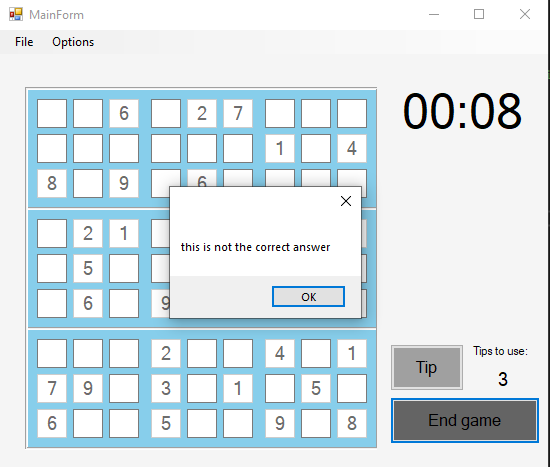
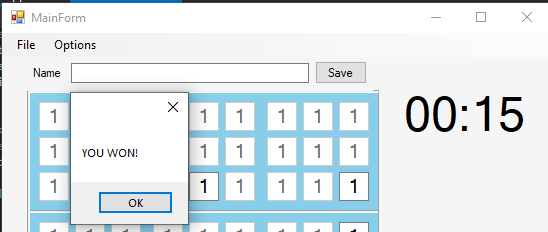

# Sudoku C++
### Aplikacja umożliwiająca rozgrywkę Sudoku.

### Autorzy
- Konrad Rejman
- Mateusz Matyaszek
- Adam Marzec

### Opis aplikacji
Aplikacja jest napisana w języku C++ i pozwala na przeprowadzenie rozgrywki Sudoku. Do wyboru mamy różne plansze oraz 3 poziomy trudności - po 3 plansze dla każdego poziomu trudności.

### Działanie aplikacji

- Po uruchomieniu aplikacji pojawia nam się widok tabeli wyników, w której możemy zobaczyć nazwę gracza oraz czas jaki zdobył.

- Aby zacząć nową grę wybieramy zakładkę File, następnie z listy New game. Rozwija nam się podlista z wyborem poziomu trudności. 

- Nowa gra. Po prawej stronie znajduję się licznik, odmierzający nasz czas gry. W wolne kratki wpisujemy cyfry, sukcesywnie dążąc do rozwiązania Sudoku. Dzięki zastosowaniu walidacji wprowadzanych danych, omyłkowe wpisanie niedozwolonego znaku jest niemożliwe. 

- Jeśli wybrany na początku poziom trudności przeróśł nasze możliwości, możemy skorzystać z podpowiedzi. Po kliknięciu przycisku Tip, pierwsze wolne pole zostanie wypełnione poprawną liczbą. Po prawej stronie okna wyświetla się liczba pozostałych podpowiedzi do wykorzystania.

- Pod zakładką Options znajdziemy możliwość ustawienia jednego z 4 dostępnych limitów czasu rozgrywki.

- Jeśli zakończymy grę bez wypełnienia pól poprawnymi cyframi, dostaniemy stosowną odpowiedź zwrtoną...

... podobnie stanie się, jeśli skończy nam się czas.

- Jeśli jednak uda nam się poprawnie rozwiązać Sudoku, gra zostaje zakończona z pozytywnym wynikiem.

